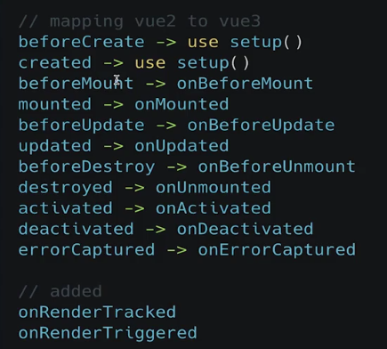

<blockquote class="blockquote-center">
</img>
vue3都做了什么呢？
</blockquote>
<!-- more -->
#### 性能提升
- 打包大小减少41%
- 初次渲染快55%，133%
- 内存使用减少54%

#### Composition API
- ref 和 reactive
- computed 和 watch
- 新的生命周期函数
- 自定义函数-Hooks 函数

#### 新增特性
- Teleport 瞬移组件的位置
- Suspense 异步加载组件的新福音
- 全局 API 的修改和优化
- 更多的试验性特性

#### 更好的ts支持


#### 为什么要有vue3（解决现有存在的棘手问题）
- 随着功能的增长，复杂组件的代码变得难以维护

- Mixin 的缺点

1. 明明冲突
2. 不清楚暴露出来的变量的作用
3. 重用到其他component经常遇到问题


- setup 中无法访问 this

- 新生命周期



#### 免费api： https://dog.ceo/dog-api/

#### teleport 瞬间移动

- 将子节点渲染到存在于父组件以外的 DOM 节点

#### definedComponent

- 为ts而定义，保存输入输出整个对象，组件的定义与导出都是 object，更好的提示

#### Suspense

- 异步请求的困境
- suspense 是 vue3 推出的一个内置的特殊组件
- 使用 suspense，要返回一个 promise

```vue
<!--如果放两个组件不显示，那么加一个div即可-->
<Suspense>
<template #default>
  <div>
    <asyncShow></asyncShow>
    <dogShow></dogShow>
  </div>
</template>
<template #fallback>
  <h1>loading ------ </h1>
</template>
</Suspense>
```

#### vue2 全局 API 遇到的问题

- 在单元测试中，全局配置非常容易污染全局环境
- 在不同的 apps 中，共享一份有不同配置的 vue 对象，也变得非常困难

##### 全局配置：Vue.config -> app.config

- config.productionTip 被删除
- config.ignoredElements 改名为 config.isCustomElement
- config,keyCodes 被删除

#### 全局注册类 API

- Vue.component -> app.component
- Vue.directive -> app.directive

#### 行为扩展类
- Vue，minxin -> app.minxin
- Vue.use -> app.use


#### 完美的 vue 实践项目是怎样的？
- 数据的展示 - 最好是有多级复杂数据的展示
- 数据的创建 - 可以发散出多个功能
- 组件的抽象 - 循序渐进的组件开发

- 整体状态数据结构的设计和实现
- 权限管理和控制
- 真实的后端 API

#### 开发流程

- 将 ui 话划分出组件的层级
- 创建应用的静态版本


